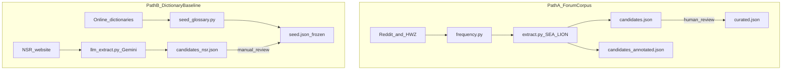

# Architecture — NS Lingo NLP Project

## Overview

Corpus-building and NLP exploration project for Singapore National Service (NS) lingo.
Raw text is scraped from public sources and cross-referenced with existing NS dictionaries.
Candidate terms are pre-annotated via LLM, validated with NS friends, and curated into a
structured glossary. The glossary powers a **RAG + Gemini** bot: retrieval grounds answers
in `seed.json` and `curated.json`; Gemini generates natural explanations. End goal is a
Discord bot that explains NS lingo to civilians without hallucinating definitions.

For the bot roadmap, see [fine-tuning-plan.md](fine-tuning-plan.md). For glossary workflow, see [glossary-pipeline.md](glossary-pipeline.md).

---

## Mental model: three layers

| Layer | What it is | Key paths |
|-------|------------|-----------|
| **1 — Raw text** | Scraped forum posts, comments, HWZ threads | `data/raw/`, `data/cleaned/` |
| **2 — Processing** | Python scripts that transform text into candidates and annotations | `scraper/`, `corpus/` |
| **3 — Glossary data** | JSON files with distinct roles — do not treat them as interchangeable | `data/glossary/` |

Layer 3 has **two parallel pipelines** that feed different files (see below). They are intentionally kept separate: `seed.json` is the frozen dictionary baseline; `curated.json` holds forum-validated extensions.

---

## Two parallel glossary pipelines



### Path A — Forum corpus → frequency → SEA-LION (Keon's track)

```
main.py / fetch_comments.py / hwz_scraper.py
    → data/raw/
    → clean.py
    → data/cleaned/

corpus/frequency.py
    → data/cleaned/frequency.json

corpus/extract.py  (SEA-LION: aisingapore/Llama-SEA-LION-v3-8B)
    → data/glossary/candidates.json           (93 terms — triage list)
    → data/glossary/candidates_annotated.json   (same 93 + LLM annotations)

Human triage in candidates.json (reviewed / rejected)
    → data/glossary/curated.json              (42 validated terms, lean schema)
```

### Path B — Dictionaries + NSR site → seed (Rae's track)

```
scraper/seed_glossary.py
    → data/glossary/seed.json

corpus/llm_extract.py  (Gemini: gemini-3.1-flash-lite)
    → data/glossary/candidates_nsr.json   (ephemeral intermediate — not always in repo)

Manual review of Gemini output
    → merge approved terms into seed.json   (206 → 292 entries)
```

**Important:** `llm_extract.py` does **not** output to `curated.json`. Gemini-extracted terms belong in the frozen baseline (`seed.json`), not the forum-derived glossary.

---

## Glossary file roles

| File | Count | Source | Role |
|------|-------|--------|------|
| `seed.json` | 292 | Dictionaries + `seed_glossary.py` + Gemini NSR merge | **Frozen baseline** for models. Schema: `term`, `definition`, `category`, `source`. Do not merge forum candidates here. |
| `candidates.json` | 93 | `extract.py` ← `frequency.py` | Triage list from forum frequency. Mark `reviewed` or `rejected`. Definitions intentionally empty. |
| `candidates_annotated.json` | 93 | Same terms + SEA-LION via `extract.py` | Pre-annotated definitions (`register`, `part_of_speech`, `confidence`). Awaiting human validation. |
| `curated.json` | 42 | Human-reviewed forum terms | Lean schema with `variants`, `related_terms`, `definition_source`. Complements seed. |
| `candidates_nsr.json` | — | `llm_extract.py` (Gemini) | Ephemeral intermediate output before manual merge into `seed.json`. |

### `seed.json` "frozen" policy

- **Frozen going forward** — forum-discovered terms go to `curated.json`, not `seed.json`.
- **Was expanded once** — Gemini NSR extraction merged 86 new terms (206 → 292) after manual review.
- **Purpose** — stable reference layer for RAG and fine-tuning; avoids polluting the baseline with noisy forum phrases.

---

## Stages

The project is split into five sequential stages:

| Stage | What it produces | Status |
|-------|------------------|--------|
| **1 — Scrape existing dictionaries** | `seed.json` with 292 entries | Done |
| **2 — Forum data + frequency analysis** | Raw Reddit/HWZ text → cleaned → frequency list → candidate terms | Done |
| **3 — LLM extraction + crowdsourcing** | Annotated candidates → human review → `curated.json` | Done (50 curated entries); crowdsourcing optional |
| **4 — RAG + Gemini** | Glossary-grounded answers (`bot/rag.py`, `bot/rag_eval.py`) | In progress |
| **5 — Bot** | Discord bot (RAG + Gemini) | Planned |

---

## Pipeline (end-to-end)

```
PATH B — DICTIONARIES
  seed_glossary.py ──► seed.json (frozen baseline)
  llm_extract.py ──► candidates_nsr.json ──► manual review ──► seed.json

PATH A — FORUM CORPUS
  SCRAPER ──► data/raw ──► clean.py ──► data/cleaned/
                                              │
                                              ▼
                                   corpus/frequency.py ──► frequency.json
                                              │
                                              ▼
                                   corpus/extract.py (SEA-LION)
                                              │
                         ┌────────────────────┴────────────────────┐
                         ▼                                         ▼
                 candidates.json                    candidates_annotated.json
                         │                                         │
                         │ human triage + review │
                         ▼                         │
                   curated.json                    │
                         │
                         ▼
              bot/rag.py ──► glossary lookup
                         │
                         ▼
              Gemini API ──► grounded answer
                         │
                         ▼
              bot/discord_bot.py (planned)
```

---

## Component Diagram

```
┌─────────────────────────────────────────────────────────────────────────────────────┐
│                         scraper/                                                      │
│  main.py                hwz_scraper.py            seed_glossary.py          │
│  ────────               ─────────────             ────────────────            │
│  Scrapes Reddit         Scans EDMW titles         Scrapes existing            │
│  (public JSON API,      for NS keywords           NS dictionaries             │
│  no auth needed)        + scrapes threads                                     │
└───────────────────────┬──────────────────────────────────────────────────────────────┘
                        │ raw JSON / HTML
                        ▼
┌─────────────────────────────────────────────────────────────────────────────────────┐
│                         data/                                                          │
│  raw/          — scraped output, never touch                                          │
│  cleaned/      — deduped, normalised text (posts + comments)                          │
│  glossary/     — seed (frozen), candidates, annotated, curated                          │
└───────────────────────┬──────────────────────────────────────────────────────────────┘
                        │ cleaned text
                        ▼
┌─────────────────────────────────────────────────────────────────────────────────────┐
│                         corpus/                                                       │
│  frequency.py      extract.py           llm_extract.py                                 │
│  ─────────────     ──────────           ──────────────                                 │
│  word / n-gram     SEA-LION annotation  Gemini extraction from NSR pages               │
│  counts            on forum candidates                                                   │
└───────────────────────┬──────────────────────────────────────────────────────────────┘
                        │ glossary JSON
                        ▼
┌─────────────────────────────────────────────────────────────────────────────────────┐
│                    Validation (manual step)                                            │
│  Triage candidates.json → human review → curated.json (lean schema)                     │
│  Google Form / CSV → NS friends (crowdsourcing, optional)                              │
└───────────────────────┬──────────────────────────────────────────────────────────────┘
                        │ verified entries
                        ▼
┌─────────────────────────────────────────────────────────────────────────────────────┐
│                         fine_tune/ (future)                                            │
│  prepare_data.py        train.py                                                       │
│  ────────────────       ─────────                                                      │
│  Converts seed +         Fine-tunes a pre-trained Singlish model                        │
│  curated + NS comments   (term-definition pairs, MLM, QA)                               │
└───────────────────────┬──────────────────────────────────────────────────────────────┘
                        │ fine-tuned model
                        ▼
┌─────────────────────────────────────────────────────────────────────────────────────┐
│                         bot/ (future)                                                   │
│  discord_bot.py        rag_engine.py        glossary_loader.py                         │
│  ──────────────        ─────────────        ──────────────────                         │
│  slash commands        retrieval-           loads seed + curated                        │
│  + message hook        augmented            glossary into vector store                  │
│                        generation                                                       │
└─────────────────────────────────────────────────────────────────────────────────────┘
```

---

## Glossary Schema

Target schema for fully curated entries:

| Field | Description | Example |
|-------|-------------|---------|
| `term` | The main term | `rabak` |
| `variants` | Alternate spellings / clippings | `rabz` |
| `definition` | Dictionary-style definition | "Disorderly, chaotic, or messed up" |
| `example_sentences` | Usage in context extracted from corpus | "Sgt chao keng rabak already" |
| `etymology` | Origin of the term | Hokkien; `rah bak` (literally "meat mash") |
| `register` | Informality level | `informal` / `vulgar` / `formal` |
| `vocation_scope` | Which NS vocations use it | `universal` / `BMT` / `infantry` / `naval` / `airforce` |
| `related_terms` | Cross-references | `chao keng`, `geng` |
| `part_of_speech` | Grammatical category | `adjective` / `verb` / `noun` / `interjection` |
| `user_facing_explanation` | Plain-English or Singlish explanation for civilians | "It means someone is acting disorderly or things are in chaos." |

Current files use subsets of this schema. `seed.json` has four fields. `curated.json` uses the lean schema documented in [glossary-pipeline.md](glossary-pipeline.md) (`term`, `definition`, `variants`, `register`, `part_of_speech`, `source`, `definition_source`, `related_terms`, `example_sentences`, `notes`).

---

## Glossary Pipeline Detail

### Path B — Seed (existing dictionaries + Gemini NSR)

Existing NS lingo dictionaries are scraped via `scraper/seed_glossary.py` into `seed.json`.
Gemini extraction from national-service.vercel.app (BMT + General pages) outputs to
`candidates_nsr.json`; after manual review, approved terms merge into `seed.json`.

| Source | Type |
|--------|------|
| national-service.vercel.app/lingo | Community wiki |
| national-service.vercel.app (BMT + General pages) | Gemini extraction |
| SAFTI MI abbreviations page | Official |
| CMPB ranks and drill commands | Official |
| defencepioneer.sg articles | Media |
| thesmartlocal.com guide | Media |
| straitstimes.com article | Media |
| speakgoodsinglishmovement.blogspot.com | Community guide |
| shopee.sg blog | Media |

### Path A — Corpus extraction (forum frequency)

Cleaned posts and comments from `data/cleaned/` are processed to surface candidate terms:

1. **Frequency analysis** (`corpus/frequency.py`) — tokenise, count n-grams, filter stopwords.
2. **Candidate extraction + annotation** (`corpus/extract.py`) — filter frequency data using NS heuristics; annotate with SEA-LION. Outputs `candidates.json` and `candidates_annotated.json`.
3. **Human triage + review** — mark terms in `candidates.json`; build and manually refine `curated.json` using annotations and seed as reference (not blind copy).

### Curated modeling notes

- **PES:** umbrella `pes` record plus specific `pes bp` / `pes b1` / `pes b4` / `pes c9` where corpus surfaced them; no standalone `b4`
- **Intake batches:** canonical `intake` term with month names in `variants`, not separate records per month
- **NS Fit:** separate `ns fit` record; `remedial training` marked historical with `related_terms`
- **Manual curated edits** do not auto-sync back to `seed.json`

### Crowdsourcing (optional, Iter 2)

Collect terms from NS friends (term + definition + example) via Google Form or CSV.
Not blocking fine-tuning, but catches vocation-specific slang frequency analysis misses.

### Fine-tuning (Stage 4)

The seed + curated glossaries and cleaned NS comments are converted into training examples:

| Training type | Input | Target | Purpose |
|---------------|-------|--------|---------|
| Term classification | "Sgt is damn rabak today" | Predict `rabak` | Teach model to spot NS terms |
| Definition retrieval | "What does rabak mean?" | "Disorderly, chaotic..." | QA pairs for generation |
| MLM (masked language) | "Sgt is damn [MASK] today" | `rabak` | Adapt Singlish model to NS context |

The fine-tuned model is used alongside RAG in the bot — the model provides contextual
understanding, while RAG grounds explanations in the glossary to prevent hallucination.

---

## Bot + RAG readiness

Bot work is **not blocked on crowdsourcing**; it **is blocked on glossary quality** for specific terms.

| Gate | Status |
|------|--------|
| Valid `curated.json` with definitions | Done (50 entries) |
| `seed.json` baseline (292 entries) | Done |
| Model comparison (Gemini vs SEA-LION) | Done — see [model-comparison-2026-07.md](model-comparison-2026-07.md) |
| RAG lookup (`bot/rag.py`) | Done |
| RAG eval (`bot/rag_eval.py`) | Done — run after glossary changes |
| Discord bot | Not built |

Recommended order:
1. Run `python bot/rag_eval.py` and fix glossary gaps
2. Build `bot/discord_bot.py`
3. Optional: embedding-based retrieval if keyword search misses aliases

Local LoRA fine-tuning is **de-prioritised** — see [fine-tuning-plan.md](fine-tuning-plan.md).

---

## Data Sources

| Source | Method | Auth? | Status |
|--------|--------|-------|--------|
| r/NationalServiceSG | Public JSON API | None | Active |
| HWZ EDMW (keyword search) | requests + BeautifulSoup | None | Active |
| national-service.vercel.app | BeautifulSoup + Gemini API | `GEMINI_API_KEY` | Active |
| Existing NS dictionaries | Web scrape / manual copy | None | Done |
| Manual crowdsourcing | Google Form → CSV | — | Planned |

---

## Project Structure

```
ns_lingo_nlp/
├── .env                     # Environment variables
├── main.py                  # Entry point (Reddit scraper)
├── clean.py                 # Strips unnecessary fields from raw posts
├── fetch_comments.py        # Fetches comments for scraped posts
├── requirements.txt         # Python dependencies
├── README.md                # Project overview
│
├── docs/
│   ├── README.md            # Project overview + progress log
│   ├── ARCHITECTURE.md      # This file
│   ├── project-map.md       # File-by-file map
│   └── glossary-pipeline.md # Glossary files + review workflow
│
├── data/
│   ├── raw/                 # Raw scraped data (never edit)
│   ├── cleaned/             # Deduped, normalised text (posts + comments)
│   └── glossary/
│       ├── seed.json                    # Frozen baseline (292 terms)
│       ├── candidates.json              # Forum candidates — triage (93 terms)
│       ├── candidates_annotated.json   # SEA-LION annotations (93 terms)
│       ├── candidates_nsr.json         # Gemini intermediate (ephemeral)
│       └── curated.json                # Forum-validated terms (50 entries, lean schema)
│
├── scraper/
│   ├── hwz_scraper.py
│   ├── seed_glossary.py
│   └── fetch_comments.py
│
├── corpus/
│   ├── frequency.py
│   ├── extract.py           # SEA-LION annotation (historical)
│   └── llm_extract.py       # Gemini NSR extraction
│
├── bot/
│   ├── rag.py               # Glossary merge + keyword search
│   ├── rag_eval.py          # Gemini + RAG eval on 8 prompts
│   ├── eval_prompts.py      # Shared eval questions
│   └── discord_bot.py       # (planned)
│
└── notebooks/
```

---

## Dependencies

| Package | Purpose | Stage |
|---------|---------|-------|
| `python-dotenv` | Load `.env` variables | Core |
| `requests` | HTTP calls (Reddit JSON API, NSR pages) | Scraper |
| `beautifulsoup4` | HTML parsing (HWZ, NSR pages, existing dictionaries) | Scraper |
| `google-genai` | Google Gemini API client | LLM Extraction |
| `discord.py` | Discord bot framework | Bot (future) |
| `nltk` / `spaCy` | NLP (tokenisation, lemmatisation) | Corpus |
| `sentence-transformers` | Embeddings for RAG | Bot (future) |
| `datasets` | Training data management | Model |
| `transformers` | SEA-LION inference + future fine-tuning | Corpus / Model |
| `torch` | ML framework for model inference/training | Corpus / Model |
| `accelerate` | Device mapping/offloading for large models | Corpus / Model |
| `sentencepiece` | Tokenizer support for LLMs | Corpus / Model |

---

## Environments / Config

- `.env` — user-specific secrets (e.g. `GEMINI_API_KEY`)
- No Reddit API keys required — public JSON endpoints are used
- Conda environment: `ns_lingo_nlp`
