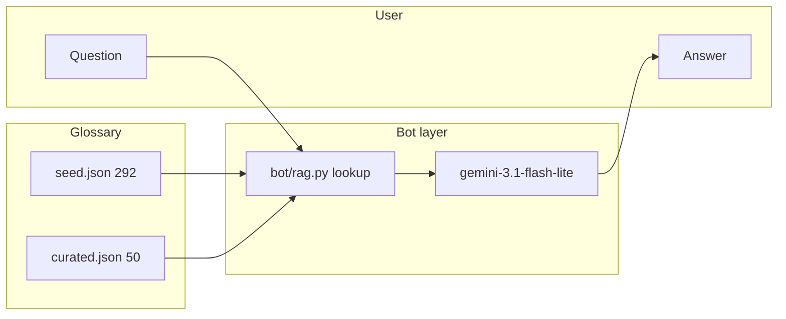

# NS Lingo Bot + RAG roadmap

Updated July 2026 after model comparison. See [model-comparison-2026-07.md](model-comparison-2026-07.md).

**Decision:** Use **Gemini + RAG** over `seed.json` + `curated.json`. De-prioritise local LoRA fine-tuning (Danube2, SEA-LION as bot backend).

See also [ARCHITECTURE.md](ARCHITECTURE.md) and [glossary-pipeline.md](glossary-pipeline.md).

---

## Readiness verdict

| Question | Answer |
|----------|--------|
| Glossary ready for RAG? | **Yes** — 50 curated + 292 seed entries |
| Best zero-shot model tested? | **Gemini 3.1 Flash Lite** (beats SEA-LION 8B) |
| RAG prototype built? | **Yes** — `bot/rag.py`, `bot/rag_eval.py` |
| Discord bot? | Not yet |

---

## Why not local fine-tuning (for now)

| Model | Result on 8 NS prompts |
|-------|------------------------|
| Danube2 Singlish 1.8B | Hallucinated heavily (Narnia, chess, etc.) |
| SEA-LION v3 8B | Often refused or wrong |
| Gemini 3.1 Flash Lite (zero-shot) | Strong; still wrong on some terms (e.g. stand by area) |

Fine-tuning a small local model is unlikely to beat **Gemini + grounded glossary**. Local 8B on an 8GB laptop is also awkward for training.

**Optional later:** fine-tune only if RAG + Gemini still fails on held-out prompts after glossary fixes.

---

## Architecture (new path)



RAG provides **ground truth**; Gemini provides **natural language** and Singlish context.

---

## Phase 0 — Model comparison (done)

Compared zero-shot Gemini vs SEA-LION on 8 hand-written NS prompts.

- **Script:** removed (`fine_tune/compare_models.py`); results archived in [model-comparison-2026-07.md](model-comparison-2026-07.md)
- **Gemini:** no glossary, no fine-tuning — general knowledge only

---

## Phase 1 — RAG eval (current)

**Scripts:** `bot/rag.py`, `bot/rag_eval.py`

1. Merge `seed.json` + `curated.json` (curated wins on dedupe)
2. Keyword / phrase lookup for terms in the question
3. Inject top hits into Gemini prompt
4. Run same 8 eval prompts; compare to zero-shot baseline

```powershell
conda activate ns_lingo_nlp
python bot/rag_eval.py
```

**Outputs:** `bot/rag_eval_results.txt`, `bot/rag_eval_results.json`

**What to check:** Does RAG fix stand by area, rabak `(help)` in seed, etc.? Any glossary gaps to fix in `curated.json`?

---

## Phase 2 — Discord bot MVP

**Folder:** `bot/`

| Piece | Purpose |
|-------|---------|
| `rag.py` | Glossary merge + search (exists) |
| `discord_bot.py` | `discord.py` client, slash command or mention handler |
| `.env` | `GEMINI_API_KEY`, `DISCORD_BOT_TOKEN` |

**Flow:**
1. User sends sentence or term question
2. RAG retrieves glossary entries
3. Gemini answers grounded in excerpts
4. Reply in Discord

---

## Phase 3 — Improve retrieval (optional)

| Upgrade | When |
|---------|------|
| `sentence-transformers` embeddings | Keyword search misses aliases (e.g. SBA vs stand by area) |
| Hybrid search | Scale beyond ~340 terms |
| Term detection in full sentences | Bot explains terms *in context* |

---

## Phase 4 — Glossary + eval hygiene

- Fix weak seed entries (`Rabak: (help)`, `SBA` definition)
- Add missing curated terms from eval failures
- Expand `bot/eval_prompts.py` with held-out cases
- Re-run `rag_eval.py` after each glossary batch

---

## Environment notes

**Conda env:** `ns_lingo_nlp`

```powershell
conda activate ns_lingo_nlp
where python   # must show ...\envs\ns_lingo_nlp\python.exe
python -m pip install google-genai python-dotenv
```

Avoid `pip install` in `base` — use `python -m pip` in the activated env, or `conda run -n ns_lingo_nlp python -m pip install ...`.

**Gemini:** `GEMINI_API_KEY` in `.env` (no quotes).

---

## Deprecated / removed

| Path | Status |
|------|--------|
| `fine_tune/` | Removed — Danube2 phase 0, compare harness |
| Local LoRA on Danube2 / SEA-LION | De-prioritised |
| `fine_tune/prepare_data.py`, `train.py` | Not planned unless RAG path insufficient |
