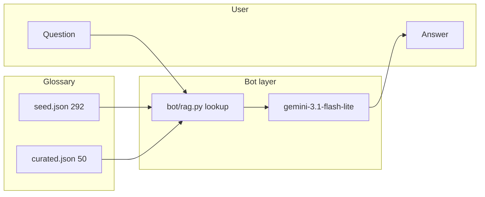

# NS Lingo Bot + RAG roadmap

Updated July 2026 after model comparison. See [model-comparison-2026-07.md](model-comparison-2026-07.md).

**Decision:** Use **Gemini + RAG** over `seed.json` + `curated.json`. De-prioritise local LoRA fine-tuning (Danube2, SEA-LION as bot backend).

See also [ARCHITECTURE.md](ARCHITECTURE.md) and [glossary-pipeline.md](glossary-pipeline.md).

---

## Readiness verdict

| Question | Answer |
|----------|--------|
| Glossary ready for RAG? | **Yes** — 50 curated + 292 seed entries |
| Best zero-shot model tested? | **Gemini 3.1 Flash Lite** (beats SEA-LION 8B) |
| RAG prototype built? | **Yes** — `bot/rag.py`, `bot/rag_eval.py` |
| Discord bot? | Not yet |

---

## Why not local fine-tuning (for now)

| Model | Result on 8 NS prompts |
|-------|------------------------|
| Danube2 Singlish 1.8B | Hallucinated heavily (Narnia, chess, etc.) |
| SEA-LION v3 8B | Often refused or wrong |
| Gemini 3.1 Flash Lite (zero-shot) | Strong; still wrong on some terms (e.g. stand by area) |

Fine-tuning a small local model is unlikely to beat **Gemini + grounded glossary**. Local 8B on an 8GB laptop is also awkward for training.

**Optional later:** fine-tune only if RAG + Gemini still fails on held-out prompts after glossary fixes.

---

## Architecture (new path)


```mermaid
flowchart LR
    subgraph glossary [Glossary]
        seed[seed.json 292]
        curated[curated.json 50]
    end
    subgraph bot_layer [Bot layer]
        rag[bot/rag.py lookup]
        gemini[gemini-3.1-flash-lite]
    end
    subgraph user [User]
        q[Question]
        a[Answer]
    end
    seed --> rag
    curated --> rag
    q --> rag
    rag --> gemini
    gemini --> a
```

RAG provides **ground truth**; Gemini provides **natural language** and Singlish context.

---

## Phase 0 — Model comparison (done)

Compared zero-shot Gemini vs SEA-LION on 8 hand-written NS prompts.

- **Script:** removed (`fine_tune/compare_models.py`); results archived in [model-comparison-2026-07.md](model-comparison-2026-07.md)
- **Gemini:** no glossary, no fine-tuning — general knowledge only

---

## Phase 1 — RAG eval (current)

**Scripts:** `bot/rag.py`, `bot/rag_eval.py`

1. Merge `seed.json` + `curated.json` (curated wins on dedupe)
2. Keyword / phrase lookup for terms in the question (whole-word; tolerates hyphens, spacing, small typos)
3. Add up to 3 meaning-based matches from local embeddings (catches paraphrases)
4. Inject hits into Gemini prompt
5. Run same 8 eval prompts; compare to zero-shot baseline

```powershell
conda activate ns_lingo_nlp
python bot/rag_eval.py
```

**Outputs:** `bot/rag_eval_results.txt`, `bot/rag_eval_results.json`

**What to check:** Does RAG fix stand by area, rabak `(help)` in seed, etc.? Any glossary gaps to fix in `curated.json`?

**Other evals:**

| Script | What it measures | Cost |
|--------|------------------|------|
| `python bot/retrieval_eval.py` | Did retrieval find the right glossary entries? 40 cases in `retrieval_cases.json` (direct, sentence, false-positive, spelling, paraphrase, unknown). `--no-semantic` = keyword only | Free |
| `python bot/answer_eval.py --mode rag` | Does the LLM answer name the right term? Same 40 cases | ~$0.004 |

Current scores (27/09/26): retrieval 37/40 (33/40 keyword-only), answers 34/40.

---

## Phase 2 — Discord bot MVP (built 27/09/26)

**Folder:** `bot/`

| Piece | Purpose |
|-------|---------|
| `rag.py` | Glossary merge + search |
| `llm.py` | LLM client shared with the evals |
| `discord_bot.py` | `/ns` slash command, @mentions and DMs; 20 questions/user/hour |
| `.env` | `OPENROUTER_API_KEY` (or `GEMINI_API_KEY`), `DISCORD_BOT_TOKEN` |

**Flow:**
1. User sends sentence or term question
2. RAG retrieves glossary entries
3. Gemini answers grounded in excerpts
4. Reply in Discord

Setup and running: [discord-bot.md](discord-bot.md).

---

## Phase 3 — Improve retrieval (done 27/09/26)

| Upgrade | Status |
|---------|--------|
| Whole-word matching (`mo` no longer hits "mono") | Done |
| Spelling/spacing tolerance (`book-out`, `chaokeng`, `rabbak`) | Done |
| `sentence-transformers` embeddings (`all-MiniLM-L6-v2`, local, cutoff 0.55) | Done — paraphrases 0/5 → 4/5 |
| Hybrid search (keyword first, embeddings fill in) | Done |
| Full glossary in prompt | Tested, rejected — same answer score, ~25x cost |

Known gaps: common words matching acronyms (`mom` → MOM, `pop` → POP); "date I finish NS" → `enlistment date` instead of `ORD`.

---

## Phase 4 — Glossary + eval hygiene

- Fix weak seed entries (`Rabak: (help)`, `SBA` definition)
- Add missing curated terms from eval failures
- Expand `bot/eval_prompts.py` with held-out cases
- Re-run `rag_eval.py` after each glossary batch

---

## Environment notes

**Conda env:** `ns_lingo_nlp`

```powershell
conda activate ns_lingo_nlp
where python   # must show ...\envs\ns_lingo_nlp\python.exe
python -m pip install -r requirements.txt
```

`requirements.txt` was UTF-16 until 27/09/26, which pip can't read — it is UTF-8 now.

Avoid `pip install` in `base` — use `python -m pip` in the activated env, or `conda run -n ns_lingo_nlp python -m pip install ...`.

**LLM key:** `OPENROUTER_API_KEY` or `GEMINI_API_KEY` in `.env` (no quotes). If both are set, OpenRouter is used (`google/gemini-3.1-flash-lite`, same model).

**Embeddings:** first search downloads `all-MiniLM-L6-v2` (~90MB) and takes ~20s to load; each query after is ~30ms. Without `sentence-transformers` installed, search falls back to keyword-only.

---

## Deprecated / removed

| Path | Status |
|------|--------|
| `fine_tune/` | Removed — Danube2 phase 0, compare harness |
| Local LoRA on Danube2 / SEA-LION | De-prioritised |
| `fine_tune/prepare_data.py`, `train.py` | Not planned unless RAG path insufficient |
