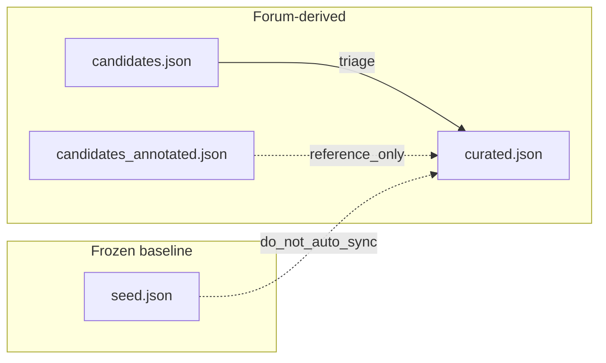

# Glossary Pipeline

How the glossary JSON files relate, and how forum candidates become `curated.json`.

See also [ARCHITECTURE.md](ARCHITECTURE.md) for the full system design.

---

## Two pipelines, four files

| Pipeline | Input | Output file | Tool |
|----------|-------|-------------|------|
| **Dictionary baseline** | Online dictionaries + NSR website | `seed.json` | `seed_glossary.py`, `llm_extract.py` (Gemini) |
| **Forum corpus** | Reddit + HWZ text | `candidates.json` → `curated.json` | `frequency.py`, `extract.py` (SEA-LION) |



`candidates_annotated.json` is an audit/reference file from the SEA-LION run. Human review happens directly in `curated.json`.

---

## File reference

### `seed.json` — frozen baseline

- **292 entries** from dictionary scraping + Gemini NSR extraction
- **Schema:** `term`, `definition`, `category`, `source`
- **Policy:** Do not add forum-frequency candidates here. Manual curated fixes stay in `curated.json` unless you deliberately maintain seed in a separate pass.

### `candidates.json` — triage list (historical)

- **93 entries** from forum frequency analysis
- **Status values:** `reviewed` (59) or `rejected` (34)
- Audit trail only — definitions intentionally empty

### `candidates_annotated.json` — SEA-LION pre-annotations (historical)

- Same 93 terms with LLM-generated definitions
- Reference for what SEA-LION produced; not the source of truth after human review

### `curated.json` — forum-validated glossary

- **42 entries** after human review and cleanup (July 2026)
- **Lean schema** (see below)
- Complements `seed.json`; `prepare_data.py` should dedupe by term when building training pairs

### `candidates_nsr.json` — ephemeral Gemini output

- Intermediate output of `llm_extract.py` (not always in repo)
- Approved terms merge into `seed.json`, not `curated.json`

---

## `curated.json` schema

Each entry uses this structure:

```json
{
  "term": "pop",
  "definition": "Passing Out Parade; the parade that marks the end of your basic military training.",
  "variants": [],
  "register": "informal",
  "part_of_speech": "acronym",
  "source": "frequency_analysis",
  "definition_source": "seed",
  "related_terms": ["bmt"],
  "example_sentences": [],
  "notes": ""
}
```

| Field | Purpose |
|-------|---------|
| `term` | Canonical lookup key |
| `definition` | Human-verified definition |
| `variants` | Alternate spellings or surface forms (e.g. `nsti` → `nstc jalan bahar`) |
| `register` | `formal` / `informal` / `slang` |
| `part_of_speech` | Grammatical category |
| `source` | `frequency_analysis` or `manual` |
| `definition_source` | `manual` / `seed` / `llm` — provenance of the definition |
| `related_terms` | Cross-references without separate records |
| `example_sentences` | Usage in context (fill over time) |
| `notes` | Freeform reviewer notes |

Removed workflow fields (no longer used): `review_status`, `annotation_status`, `confidence`, `count`, `term_type`, `status`, `in_seed_glossary`.

---

## Modeling decisions

### PES terms — parent + specific statuses

- **`pes`** — umbrella definition of the PES system; `related_terms` links to specific grades
- **`pes status`**, **`pes bp`**, **`pes b1`**, **`pes b4`**, **`pes c9`** — separate records only where the corpus surfaced distinct phrases
- Do not create records for every historical PES grade unless needed
- Standalone **`b4`** removed (ambiguous); use **`pes b4`** instead

### Intake / batches — one canonical term

- **`intake`** is the canonical term
- Month-specific phrases (`october batch`, `january batch`) go in **`variants`**, not as separate records
- Deleted from curated: `october batch`, `enlistment august`, `august intake`

### NS Fit vs remedial training

- **`remedial training`** — historical programme, `related_terms: ["ns fit"]`
- **`ns fit`** — separate current programme record (also exists in `seed.json`)

### Manual edits do not sync to seed

Curated manual corrections stay in `curated.json`. Update `seed.json` only in a deliberate separate maintenance pass if a baseline entry is factually wrong.

---

## Review workflow (completed)

1. Triage in `candidates.json` — 59 reviewed, 34 rejected
2. Build `curated.json` from approved terms
3. Enrich from `candidates_annotated.json` with seed fallbacks (one-time, July 2026)
4. Human review pass — fix definitions, add `variants`, delete noise, strip workflow fields

Rejected or redundant terms are **deleted from `curated.json`** (they remain in `candidates.json`).

---

## What not to do

- Do not merge forum candidates into `seed.json`
- Do not re-introduce `review_status` or merge scripts into `curated.json`
- Do not create one record per enlistment month — use `intake` + `variants`
- Do not delete `candidates.json` or `candidates_annotated.json` — audit trail

---

## Fine-tuning gate

| Check | Status |
|-------|--------|
| Valid `curated.json` | Done (42 entries) |
| Definitions filled | Done |
| Human review | Done (July 2026 cleanup) |
| `fine_tune/prepare_data.py` | **Next step** |
| Inspect training pairs | Before running `train.py` |

`seed.json` (292 terms) + `curated.json` (42 terms) is enough for MVP fine-tuning prep. Crowdsourcing and larger scrapes are optional.
